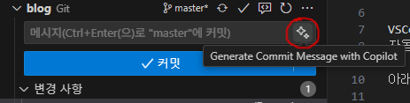
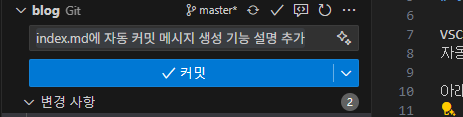
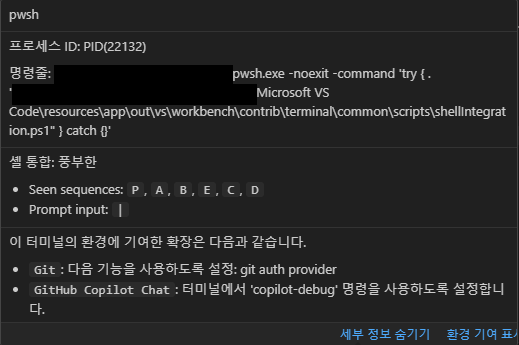
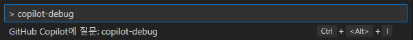

# VSCode 의 신기한 기능 - 자동 커밋 메시지

## 들어가기

VSCode 에 신기한 기능이 생겼다. \
자동 커밋 메시지 생성 기능이다.

아래 그림과 같이 반짝이(Generate Commit Message with Copilot)를 클릭하면,



이렇게 적절한 커밋 메시지를 생성해준다.



## 자문자답1

질문1: 
- 어떻게 이게 가능한거지?
- 어떤 원리지?

질문2:
- 질문1에 대한 답을 찾으려면, 무엇부터 해야 할까?

답변2: 
- 각종 설정 파일 및 로그 기록을 찾아보자.
  - 툴팁 문구도 'Generate Commit Message with **Copilot**' 이니까, Copilot 관련 출력이나 설정을 살펴보면 되지 않을까.

## 출력 및 설정 살펴보기

### 출력 → GitHub Copilot

```log
2025-06-15 10:46:18.786 [info] [certificates] Removed 17 expired certificates
2025-06-15 10:46:19.628 [info] [fetcher] Using Helix fetcher.
2025-06-15 10:46:19.628 [info] [code-referencing] Public code references are enabled.
2025-06-15 10:46:20.281 [info] [fetcher] Using Helix fetcher.
2025-06-15 10:47:58.622 [info] [fetchCompletions] Request 3ca120a3-2b8c-45c8-9b41-a350fbdaeedf at <https://proxy.individual.githubcopilot.com/v1/engines/gpt-4o-copilot/completions> finished with 200 status after 224.04930000007153ms
2025-06-15 10:47:58.625 [info] [streamChoices] solution 0 returned. finish reason: [stop]
```

- [GPT-4o](https://namu.wiki/w/GPT-4) 모델 쓰는구나.

### 출력 → GitHub Copilot Chat

```log
2025-06-15 10:46:18.787 [info] Using the Electron fetcher.
2025-06-15 10:46:18.787 [info] [GitExtensionServiceImpl] Initializing Git extension service.
2025-06-15 10:46:18.787 [info] [GitExtensionServiceImpl] Successfully activated the vscode.git extension.
2025-06-15 10:46:18.787 [info] [GitExtensionServiceImpl] Enablement state of the vscode.git extension: true.
2025-06-15 10:46:18.787 [info] [GitExtensionServiceImpl] Successfully registered Git commit message provider.
2025-06-15 10:46:18.979 [info] Logged in as nemonuri
2025-06-15 10:46:19.853 [info] Got Copilot token for nemonuri
2025-06-15 10:46:19.865 [info] activationBlocker from 'languageModelAccess' took for 855ms
2025-06-15 10:46:19.902 [info] copilot token chat_enabled: true, sku: free_limited_copilot
2025-06-15 10:46:19.902 [info] GitHub.vscode-pull-request-github extension is not yet activated.
2025-06-15 10:46:19.906 [info] Registering default platform agent...
2025-06-15 10:46:19.906 [info] activationBlocker from 'conversationFeature' took for 899ms
2025-06-15 10:46:19.932 [info] BYOK: Copilot Chat known models list fetched successfully.
2025-06-15 10:46:20.476 [info] Fetched model metadata in 612ms dd37cebd-609a-44ec-8a61-4b84e5016b6d
2025-06-15 10:46:21.343 [info] message 0 returned. finish reason: [stop]
2025-06-15 10:46:21.343 [info] request done: requestId: [e0af9583-b44b-486c-bae2-aedac260dae7] model deployment ID: []
2025-06-15 10:48:07.572 [info] message 0 returned. finish reason: [stop]
2025-06-15 10:48:07.572 [info] request done: requestId: [e4f1e387-ce26-4b68-8dde-34744cfc368a] model deployment ID: []
2025-06-15 11:02:51.918 [info] Fetched model metadata in 699ms 74e751c8-f9dd-44a1-b3c8-0e08b2d914c4
2025-06-15 11:02:53.376 [info] message 0 returned. finish reason: [stop]
2025-06-15 11:02:53.377 [info] request done: requestId: [3febaf2e-d1c8-436b-8214-cacd446ebd6e] model deployment ID: []
2025-06-15 11:16:20.846 [info] Logged in as nemonuri
2025-06-15 11:16:21.733 [info] Got Copilot token for nemonuri
2025-06-15 11:16:21.754 [info] copilot token chat_enabled: true, sku: free_limited_copilot
2025-06-15 11:16:21.781 [info] BYOK: Copilot Chat known models list fetched successfully.
2025-06-15 11:16:22.759 [info] Fetched model metadata in 1020ms 173f50dd-34cf-48e5-ab6a-e32f02f85d52
```

- `sku: free_limited_copilot`
  - 역시, 기능 제한된 무료 copilot 이구나.
  - 근데 sku는 뭐지?

#### sku
- [Stock keeping unit](https://en.wikipedia.org/wiki/Stock_keeping_unit)
- 소프트웨어 업계에서는, 클라우드 상품 식별자라는 의미로 사용된다.

### 터미널 → pwsh → 세부 정보 표시



- `셸 통합: 풍부한`과, 그 밑의 옵션들은 뭐지?
- `copilot-debug` 라는, Copilot에게 질문하는 명령이 있구나.
  - 

### 터미널 → pwsh → 환경 기여 표시

```markdown
# 터미널 환경 변경

## 확장: vscode.git

다음 기능을 사용하도록 설정: git auth provider

- `GIT_ASKPASS=(생략)\Microsoft VS Code\resources\app\extensions\git\dist\askpass.sh`
- `VSCODE_GIT_ASKPASS_NODE=(생략)\Microsoft VS Code\Code.exe`
- `VSCODE_GIT_ASKPASS_EXTRA_ARGS=`
- `VSCODE_GIT_ASKPASS_MAIN=(생략)\Microsoft VS Code\resources\app\extensions\git\dist\askpass-main.js`
- `VSCODE_GIT_IPC_HANDLE=\\.\pipe\vscode-git-d82a5a9653-sock`

## 확장: GitHub.copilot-chat

터미널에서 'copilot-debug' 명령을 사용하도록 설정합니다.

- `PATH=${env:PATH};(생략)\Code\User\globalStorage\github.copilot-chat\debugCommand`
```

- 여기 나온 파일들의 vscode repository 링크
  - [vscode/extensions/git/src/askpass.sh](https://github.com/microsoft/vscode/blob/main/extensions/git/src/askpass.sh)
  - [vscode/extensions/git/src/askpass-main.ts](https://github.com/microsoft/vscode/blob/main/extensions/git/src/askpass-main.ts)
  - 음...결국 정확한 프롬프트가 뭔지는 알 수 없구나

## 자문자답2

질문3: 이 기능, 언제부터 생긴 거지? VSCode 버전 몇 부터?

답변3: ...나중에 알아보자. 귀찮아.

질문4:
- 이 기능, 개인 프로젝트나 오픈소스 프로젝트에서만 써야겠지?
- 회사 프로젝트 같은 곳에 쓰면 안 되겠지?

답변4:
- 당연.
- 회사 프로젝트 같은 곳에 쓰면, 즉시 정보 유출이지.
- 무료 서비스는, 사용자가 상품인데.