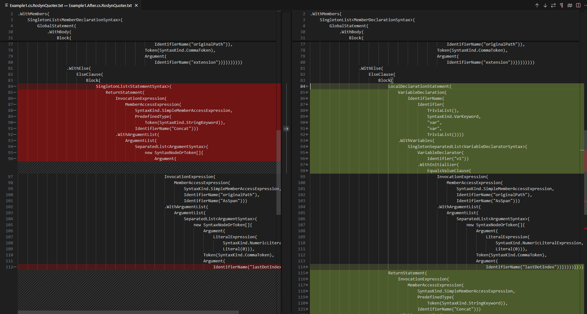
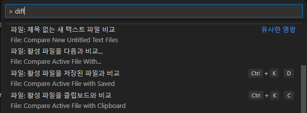

# VSCode diff

## Diff 란?

- 비슷한 두 텍스트 파일의 차이점을 분석하고, 그 결과를 출력하는 프로그램
  - POSIX 표준도 있다.
  - binary 도 비교할 수 있는 변형판도 있다고 한다.

## VSCode 로 diff 실행하기

```pwsh
code --diff <파일1> <파일2>
```

### 결과 예시



## 명령 팔레트에서 실행하기



...아, 이미 명령 팔레트에 있었구나 ㅎ

## 참고자료

- [영어 위키피디아/diff](https://en.wikipedia.org/wiki/Diff)
- [vscode/src/vs/editor/common/diff](https://github.com/microsoft/vscode/tree/main/src/vs/editor/common/diff)
  - vscode 에서 diff 를 구현한 소스 코드