# 실업급여 신청

## 넋두리

내가 실직한 지가 언젠데, 이제서야 이걸 신청하냐...하하.

## 신청 절차

[고용24](https://www.work24.go.kr/cm/main.do) 홈페이지에서 신청하면 된다.

- [공식 동영상 가이드](https://www.youtube.com/watch?v=JWBdBIMI-3M)

## 구직신청 (필수)

- 구직신청 팝업

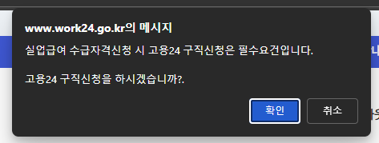

실업급여를 받으려면 고용24 구직신청을 해야 한다. **필수**로. \
일단 '확인'을 눌렀다.

- 구직신청 화면

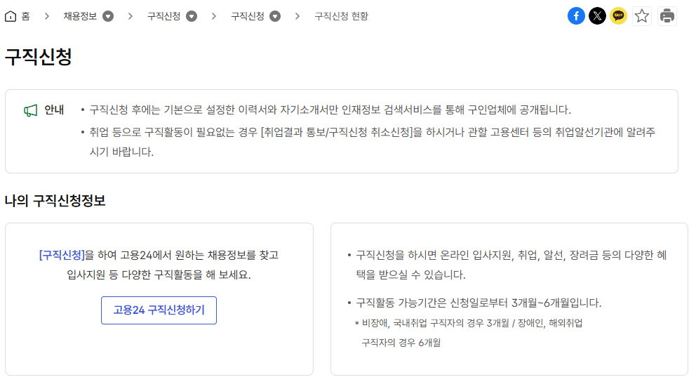

[구직신청 공식 동영상 가이드](https://www.youtube.com/watch?v=3vOQXEhqRYA)

아니, 뭐 이렇게 입력해야 할 정보가 많아;;

## 자문자답

- 질문1: 그래서, 내가 지금부터 준비해야 할 자료들이 모두 무엇이지...?
- 답변1:
  1. 증명사진
  2. (내가 과거 구직 활동에 사용했던) 이력서
     - 구직 신청서는, 이력서를 써야 하는 거구나. 하긴. 당연한건가.

 

- 질문2: 내가 너무 과하게 고민하는건가?

## 구직신청 관련 넋두리

### 임금분포

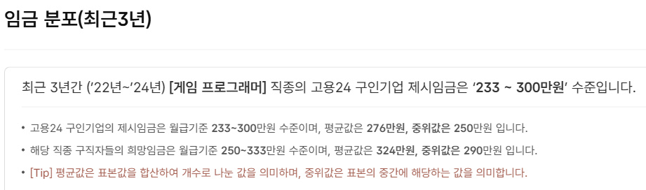

- 게임 프로그래머 관련 임금은, 고작 평균 300 미만이구나....난 적어도 400 이상은 받고 싶은데.
  - 아니, 게임 프로그래머 뿐만 아니라, 다른 분야도 300 미만이라니...;;

### 구직신청 공개 여부

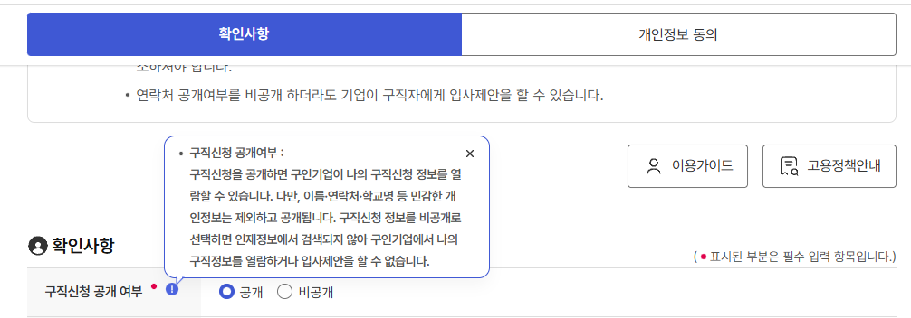

- 원하지 않으면 '구직신청 비공개'도 가능하구나! 이걸 몰랐네.
  - 다만, '비공개 사유가 뭐냐?'를 입력해야 하는군.

### 취업알선 희망시기

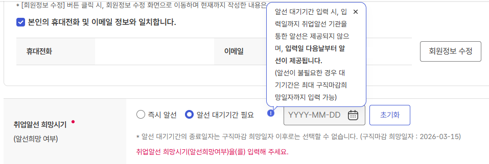

- '구직마감 희망일자'
  - 취업 알선을 언제까지고 미룰 수는 없다는 뜻이군....오케이.
  - 기간은 3개월.

### 구직신청의 목적

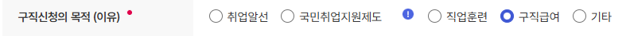

- '구직급여'가...실엽급여겠지?

#### 구직급여와 실업급여의 차이

> 구직급여는 실업자가 재취업을 위해 적극적으로 구직 활동을 하는 기간 동안 지급되는 급여를 의미합니다. \
> 반면 실업급여는 국가에서 실직한 근로자에게 지급하는 급여로, 구직급여와 취업촉진수당으로 구분됩니다. \
> 즉, **실업급여는 구직급여보다 포괄적인 개념**이며, 일반적으로 사람들이 실업급여라고 부르는 것은 구직급여를 지칭하는 경우가 많다고 할 수 있습니다.

출처([링크](https://www.shoplworks.com/blog-insight/job-seeking-allowance-unemployment-benefits-guide))

### 구직신청 완료

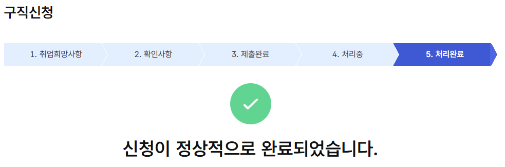

- 오, 생각보다 오래 안 걸리네. 역시, 너무 많이 고민했어. 괜히.

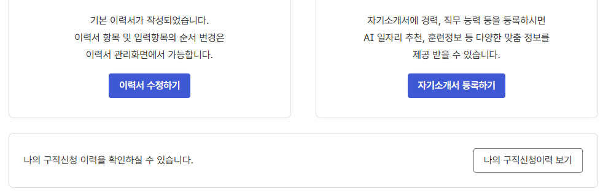

- 나중에, 더 많은 내용을 추가할 수 있다.

### 그 다음은?

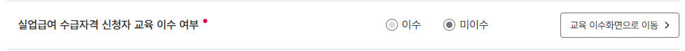

- '실업급여 수급자격 신청자 교육 이수'를 완료해야 한다!

## 수급자격 신청자 온라인 교육

### 실업급여 부정수급에 대한 처벌 등 관련 안내

> **실업급여 부정수급에 대한 처벌 등 관련 안내**
> - 취업한 사실 또는 소득이 발생한 사실을 숨기거나, 이직 사유를 거짓으로 신고한 경우, 재취업활동을 허위로 제출한 경우 등은 실업급여 부정수급에 해당할 수 있습니다.
> - 실업급여 부정수급에 대해서는 최대 5년 이하의 징역 또는 5천만원 이하의 벌금이 부과될 수 있습니다.
> - 또한, 부정하게 받은 실업급여는 모두 환수되고, 부정하게 받은 금액의 최대 5배에 해당하는 금액이 추가로 징수될 수 있습니다. 부정수급으로 인해 반환해야 하는 금액을 기한 내에 납부하지 않으면 국세 체납처분의 예에 따라 징수합니다.

...살벌하네...

### 온라인 동영상교육 안내

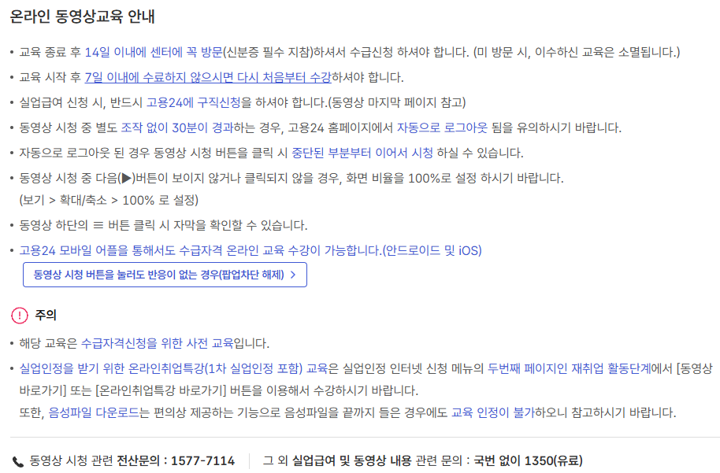

이 둘이 핵심이로군!

- 교육 종료 후 **14일 이내에 센터에 꼭 방문**(신분증 필수 지참)하셔서 수급신청 하셔야 합니다. (미 방문 시, 이수하신 교육은 소멸됩니다.)
- 교육 시작 후 **7일 이내에 수료하지 않으시면 다시 처음부터 수강**하셔야 합니다.

### 확인 팝업

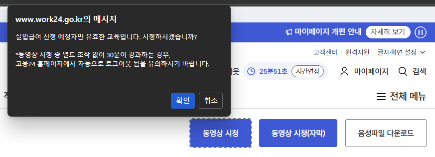

- 그냥 켜놓기만 하고 딴짓하는 거 방지까지!

### 구직급여 수급요건

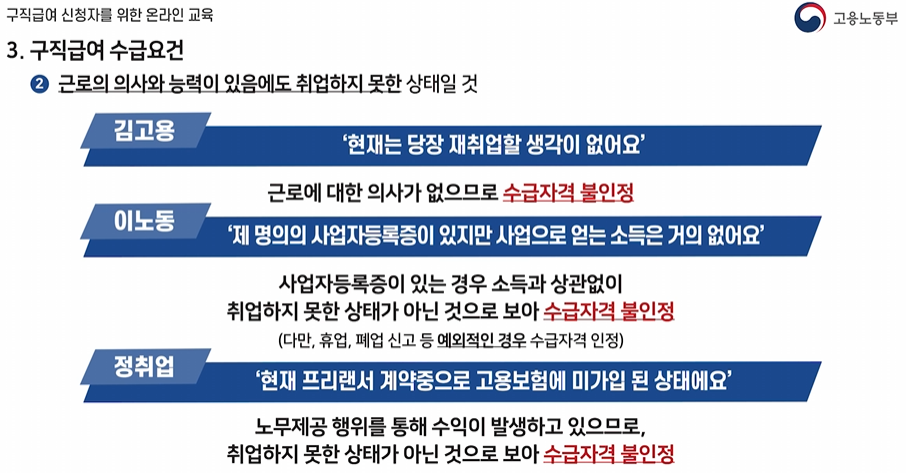

- 어...'지금 재취업 생각이 없어요' 하면 안 된다고...??

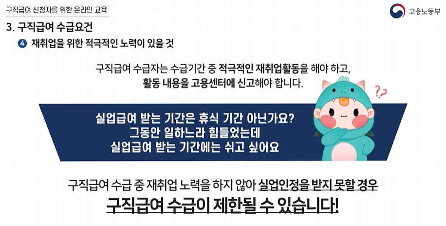

- 아 ㅋㅋㅋㅋ 쉬는 기간 아니었냐고
  - 자격증이나 인터넷 학위 공부 기록 같은 것, 올리면 되나?

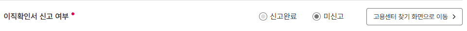

- 그 다음은, 이직확인서 신고 여부. ...이건 또 뭐냐?
- 그냥 회사 인사담당자에게 '실업급여를 위해 이직확인서 제출 부탁드립니다' 요청하니까, 며칠 후에 알아서 정부에 보내주셨다....
  - 그리고 게으름 피우는 동안, 시간이 많이 지나 온라인 동영상 교육을 다시 들어야 한다...하하.
  - 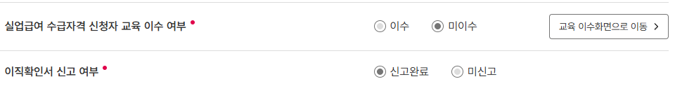
