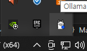

# Ollama 설치 및 실행

## 학습 목표

1. Ollama 를 설치하고 간단한 AI 채팅을 해 본다.
2. Ollama 의 여러가지 설정에 대해 알아본다.
3. Ollama 의 여러가지 명령어에 대해 알아본다.

## Ollama 란?

- [대규모 언어 모델(LLM)](https://en.wikipedia.org/wiki/Large_language_model)을 개인용 컴퓨터, 즉 로컬에서도 실행할 수 있게 하는 프로그램.
- [공식 홈페이지](https://ollama.com/)에서 설치 프로그램을 다운받을 수 있다.

## Ollama Windows 설치 경로

- Windows OS 에서, 기본 설치 경로는 `%LOCALAPPDATA%\Programs\Ollama` 이다.
- 설치 프로그램(OllamaSetup.exe)을 다음과 같이 실행하면, 설치 경로를 변경할 수 있다.
```pwsh
OllamaSetup.exe /DIR="d:\some\location"
```

## Ollama Windows 서버 실행

### 방법1. 바로 실행

1. `ollama app.exe` 를 실행한다
2. Ollama 서버가 실행중인 것을 확인한다.
  -  

### 방법2. 커맨드 쉘에서 실행

1. 커맨드 쉘에서 다음 명령어를 실행
```pwsh
PS > ./ollama.exe serve
```

2. Ollama 서버가 실행중인 것을 확인
  - 아이콘 대신, 출력 로그로.
```log
time=2025-06-19T10:29:19.000+09:00 level=INFO source=routes.go:1234 msg="server config" env="map[CUDA_VISIBLE_DEVICES: GPU_DEVICE_ORDINAL: HIP_VISIBLE_DEVICES: HSA_OVERRIDE_GFX_VERSION: HTTPS_PROXY: HTTP_PROXY: NO_PROXY: OLLAMA_CONTEXT_LENGTH:4096 OLLAMA_DEBUG:INFO OLLAMA_FLASH_ATTENTION:false OLLAMA_GPU_OVERHEAD:0 OLLAMA_HOST:http://127.0.0.1:11434 OLLAMA_INTEL_GPU:false OLLAMA_KEEP_ALIVE:5m0s OLLAMA_KV_CACHE_TYPE: OLLAMA_LLM_LIBRARY: OLLAMA_LOAD_TIMEOUT:5m0s OLLAMA_MAX_LOADED_MODELS:0 OLLAMA_MAX_QUEUE:512 OLLAMA_MODELS:(생략) OLLAMA_MULTIUSER_CACHE:false OLLAMA_NEW_ENGINE:false OLLAMA_NOHISTORY:false OLLAMA_NOPRUNE:false OLLAMA_NUM_PARALLEL:0 OLLAMA_ORIGINS:[http://localhost https://localhost http://localhost:* https://localhost:* http://127.0.0.1 https://127.0.0.1 http://127.0.0.1:* https://127.0.0.1:* http://0.0.0.0 https://0.0.0.0 http://0.0.0.0:* https://0.0.0.0:* app://* file://* tauri://* vscode-webview://* vscode-file://*] OLLAMA_SCHED_SPREAD:false ROCR_VISIBLE_DEVICES:]"
time=2025-06-19T10:29:19.012+09:00 level=INFO source=images.go:479 msg="total blobs: 16"
time=2025-06-19T10:29:19.012+09:00 level=INFO source=images.go:486 msg="total unused blobs removed: 0"
time=2025-06-19T10:29:19.012+09:00 level=INFO source=routes.go:1287 msg="Listening on 127.0.0.1:11434 (version 0.9.0)"
time=2025-06-19T10:29:19.012+09:00 level=INFO source=gpu.go:217 msg="looking for compatible GPUs"
time=2025-06-19T10:29:19.012+09:00 level=INFO source=gpu_windows.go:167 msg=packages count=1
time=2025-06-19T10:29:19.012+09:00 level=INFO source=gpu_windows.go:183 msg="efficiency cores detected" maxEfficiencyClass=1
time=2025-06-19T10:29:19.013+09:00 level=INFO source=gpu_windows.go:214 msg="" package=0 cores=16 efficiency=8 threads=24
time=2025-06-19T10:29:19.166+09:00 level=INFO source=gpu.go:319 msg="detected OS VRAM overhead" id=GPU-00a81de9-e84d-464d-6918-dc6b26705ca9 library=cuda compute=8.6 driver=12.6 name="NVIDIA GeForce RTX 3060 Ti" overhead="498.8 MiB"
time=2025-06-19T10:29:19.169+09:00 level=INFO source=types.go:130 msg="inference compute" id=GPU-00a81de9-e84d-464d-6918-dc6b26705ca9 library=cuda variant=v12 compute=8.6 driver=12.6 name="NVIDIA GeForce RTX 3060 Ti" total="8.0 GiB" available="7.0 GiB"
```

출력 로그로부터, 여러 환경 변수를 통해 Ollama 서버를 설정할 수 있다는 것을 알 수 있다.

### Ollama 서버 설정 관련 환경 변수

1. 다음을 실행해 도움말 확인
```pwsh
PS > ./ollama.exe serve --help
```

2. 결과

 | Environment Variables | Discription |
 | --- | --- |
 | OLLAMA_DEBUG | Show additional debug information (e.g. OLLAMA_DEBUG=1) | 
 | OLLAMA_HOST | IP Address for the ollama server (default 127.0.0.1:11434) | 
 | OLLAMA_KEEP_ALIVE | The duration that models stay loaded in memory (default "5m") | 
 | OLLAMA_MAX_LOADED_MODELS | Maximum number of loaded models per GPU | 
 | OLLAMA_MAX_QUEUE | Maximum number of queued requests | 
 | OLLAMA_MODELS | The path to the models directory | 
 | OLLAMA_NUM_PARALLEL | Maximum number of parallel requests | 
 | OLLAMA_NOPRUNE | Do not prune model blobs on startup | 
 | OLLAMA_ORIGINS | A comma separated list of allowed origins | 
 | OLLAMA_SCHED_SPREAD | Always schedule model across all GPUs | 
 | OLLAMA_FLASH_ATTENTION | Enabled flash attention | 
 | OLLAMA_KV_CACHE_TYPE | Quantization type for the K/V cache (default: f16) | 
 | OLLAMA_LLM_LIBRARY | Set LLM library to bypass autodetection | 
 | OLLAMA_GPU_OVERHEAD | Reserve a portion of VRAM per GPU (bytes) | 
 | OLLAMA_LOAD_TIMEOUT | How long to allow model loads to stall before giving up (default "5m") | 

#### Ollama 서버 기본 주소 (OLLAMA_HOST)
`127.0.0.1:11434`

## Ollama 채팅 클라이언트 실행

1. 다음을 실행한다.
```pwsh
PS > ./ollama.exe run 모델_식별자
```

2. `모델_식별자` 에 해당하는 모델이 설치되지 않았다면, 해당 모델을 [`공식 저장소`](https://ollama.com/search)에서 다운받아 등록하는 작업이 먼저 진행된다.
3. 2.가 완료되면, 채팅 클라이언트가 시작된다.

### 여러 줄 입력하기

- 입력 텍스트를 `"""`로 감싸면 된다.

```
>>> """Hello,
... world!
... """
I'm a basic program that prints the famous "Hello, world!" message to the console.
```

### Ollama 모델 관련 명령어

1. 모델 미리 다운받아 등록하기
```pwsh
./ollama.exe pull 모델_식별자
```

2. 로컬에 등록된 모델 목록 확인하기
```pwsh
./ollama.exe list
```

## 참고자료

- [ollama 공식 Github repository](https://github.com/ollama/ollama)
- [ollama 모델 공식 저장소](https://ollama.com/search)
- [Ollama Windows 가이드](https://github.com/ollama/ollama/blob/main/docs/windows.md)