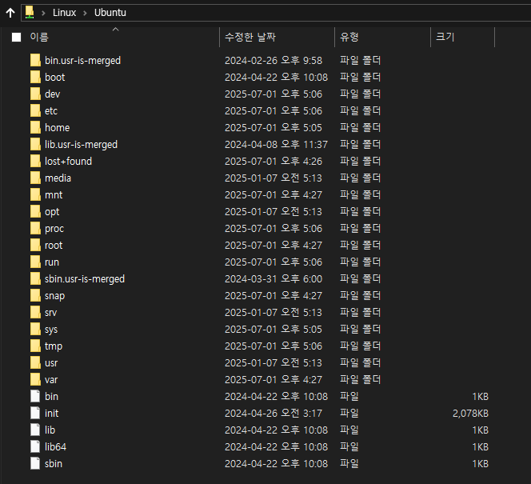
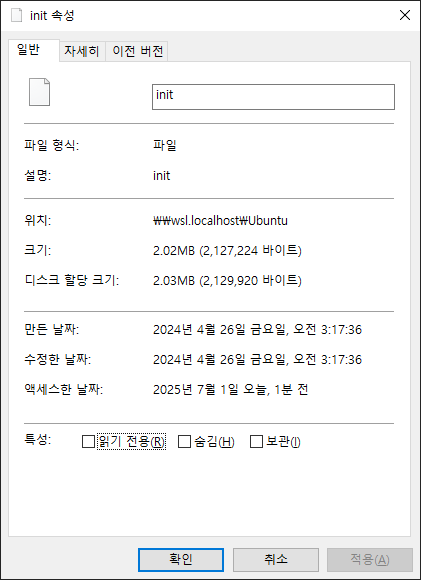
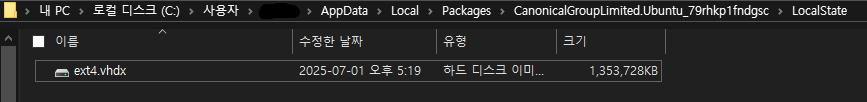

# WSL 실습1 - 설치 및 맛보기

## 학습 목표

- WSL을 사용해 원하는 Distro를 설치하는 방법을 알아본다.
- WSL Ubuntu 첫 실행 시 환경 설정을 잘 하는 방법을 알아본다.
- Distro가 어디에 설치되는지 알아보고, 설치된 Distro의 경로를 바꾸어본다.
- 설치된 WSL Distro를 실행하는 방법을 알아본다.

## wsl.exe 실행하기

1. 명령 프롬프트 또는 PowerShell 을 **관리자 권한**으로 실행한다.
2. 다음 명령을 실행해 도움말을 확인한다.

```pwsh
wsl --help
```

```
Copyright (c) Microsoft Corporation. All rights reserved.
이 제품에 대한 개인 정보 보호 정보는 https://aka.ms/privacy를 방문하세요.

사용법: wsl.exe [인수] [옵션...] [CommandLine]

Linux 이진 파일을 실행하기 위한 인수:

    명령줄이 제공되지 않으면 wsl.exe는 기본 셸을 시작합니다.

    --exec, -e <CommandLine>
        기본 Linux 셸을 사용하지 않고 지정된 명령을 실행합니다.

    --shell-type <standard|login|none>
        제공된 셸 형식으로 지정된 명령을 실행합니다.

    --
        나머지 명령줄을 있는 그대로 전달합니다.

옵션:
    --cd <디렉터리>
        지정된 디렉터리를 현재 작업 디렉터리로 설정합니다.
        ~ 가 사용되는 경우 Linux 사용자의 홈 경로가 사용됩니다. 경로가 시작되면
        / 문자를 사용하면 절대 Linux 경로로 해석됩니다.
        그렇지 않으면 값이 절대 Windows 경로여야 합니다.

    --distribution, -d <Distro>
        지정된 배포를 실행합니다.

    --user, -u <UserName>
        지정된 사용자로 실행합니다.

    --system
        시스템 배포에 대한 셸을 시작합니다.

Linux용 Windows 하위 시스템을 관리하기 위한 인수:

    --help
        사용 정보를 표시합니다.

    --debug-shell
        진단을 위해 WSL2 디버그 셸을 엽니다.

    --install [Distro] [옵션...]
        Linux 배포용 Windows 하위 시스템을 설치합니다.
        유효한 배포 목록의 경우 'wsl.exe --list --online'을 사용합니다.

        옵션:
            --no-launch, -n
                설치 후 배포를 시작하지 마세요.

            --web-download
                Microsoft Store 대신 인터넷에서 배포를 다운로드합니다.

            --no-distribution
                필요한 선택적 구성 요소만 설치하고 배포를 설치하지 않습니다.

            --enable-wsl1
                WSL1 지원을 사용하도록 설정합니다.

    --manage <Distro> <옵션...>
        배포판 관련 옵션을 변경합니다.

        옵션:
            --set-sparse, -s <true|false>
                배포판의 vhdx를 스파스로 설정하여 디스크 공간을 자동으로 회수할 수 있도록 합니다.

    --mount <디스크>
        모든 WSL 2 배포에서 실제 또는 가상 디스크를 연결하고 탑재합니다.

        옵션:
            --vhd
                <디스크>가 가상 하드 디스크를 참조하도록 지정합니다.

            --bare
                디스크를 WSL2에 연결하고 탑재하지는 마세요.

            --name <이름>
                탑재 지점의 사용자 지정 이름을 사용하여 디스크를 탑재합니다.

            --type <유형>
                디스크를 탑재할 때 사용할 파일 시스템이 지정되지 않은 경우 기본적으로 ext4입니다.

            --options <옵션>
                추가 탑재 옵션입니다.

            --partition <인덱스>
                탑재할 파티션의 인덱스가 지정되지 않은 경우 기본값은 전체 디스크입니다.

    --set-default-version <버전>
        새 배포에 대한 기본 설치 버전을 변경합니다.

    --shutdown
        실행 중인 모든 배포와 WSL 2을 즉시 종료합니다.
        경량 유틸리티 가상 머신입니다.

    --status
        Linux용 Windows 하위 시스템 상태를 표시합니다.

    --unmount [디스크]
        모든 WSL2 배포에서 디스크를 해제하고 분리합니다.
        인수 없이 호출되는 경우 모든 디스크를 해제하고 분리합니다.

    --uninstall
        이 컴퓨터에서 Linux용 Windows 하위 시스템 패키지를 제거합니다.

    --update
        Linux 패키지용 Windows 하위 시스템을 업데이트합니다.

        옵션:
            --pre-release
                사용 가능한 경우 시험판 버전을 다운로드합니다.

    --version, -v
        버전 정보를 표시합니다.

Linux용 Windows 하위 시스템 배포를 관리하기 위한 인수:

    --export <Distro> <FileName> [옵션]
        배포를 tar 파일로 내보냅니다.
        파일 이름은 - for stdout 일 수 있습니다.

        옵션:
            --vhd
                배포를 .vhdx 파일로 내보내도록 지정합니다.

    --import <Distro> <InstallLocation> <FileName> [옵션]
        지정된 tar 파일을 새 배포로 가져옵니다.
        파일 이름은 - for stdin 일 수 있습니다.

        옵션:
            --version <버전>
                새 배포에 사용할 버전을 지정합니다.

            --vhd
                제공된 파일이 tar 파일이 아닌 .vhdx 파일임을 지정합니다.
                이 작업은 지정된 설치 위치에 .vhdx 파일의 복사본을 만듭니다.

    --import-in-place <Distro> <FileName>
        지정된 .vhdx 파일을 새 배포판로 가져옵니다.
        이 가상 하드 디스크는 ext4 파일 시스템 형식으로 포맷해야 합니다.

    --list, -l [옵션]
        배포를 나열합니다.

        옵션:
            --all

배포를 포함하여 모든 배포를 나열합니다.
                현재 설치 중이거나 제거되고 있습니다.

            --running
                현재 실행 중인 배포만 나열합니다.

            --quiet, -q
                배포 이름만 표시합니다.

            --verbose, -v
                모든 배포에 대한 자세한 정보를 표시합니다.

            --online, -o
                'wsl.exe --install'을 사용하여 설치에 사용할 수 있는 배포 목록을 표시합니다.

    --set-default, -s <Distro>
        배포를 기본값으로 설정합니다.

    --set-version <Distro> <버전>
        지정된 배포의 버전을 변경합니다.

    --terminate, -t <Distro>
        지정된 배포를 종료합니다.

    --unregister <Distro>
        배포를 등록 취소하고 루트 파일 시스템을 삭제합니다.
```

## WSL로 원하는 Distro 설치하기

1. 다음 명령을 실행해 온라인에서 다운받을 수 있는 배포판들을 확인한다.

```pwsh
wsl --list --online
```

```
다음은 설치할 수 있는 유효한 배포판 목록입니다.
'wsl.exe --install <Distro>'를 사용하여 설치합니다.

NAME                            FRIENDLY NAME
Ubuntu                          Ubuntu
Debian                          Debian GNU/Linux
kali-linux                      Kali Linux Rolling
Ubuntu-18.04                    Ubuntu 18.04 LTS
Ubuntu-20.04                    Ubuntu 20.04 LTS
Ubuntu-22.04                    Ubuntu 22.04 LTS
Ubuntu-24.04                    Ubuntu 24.04 LTS
OracleLinux_7_9                 Oracle Linux 7.9
OracleLinux_8_7                 Oracle Linux 8.7
OracleLinux_9_1                 Oracle Linux 9.1
openSUSE-Leap-15.6              openSUSE Leap 15.6
SUSE-Linux-Enterprise-15-SP6    SUSE Linux Enterprise 15 SP6
openSUSE-Tumbleweed             openSUSE Tumbleweed
```

2. 다음 명령을 실행해 Ubuntu 배포판을 설치한다
   - 자동으로 실행까지 된다.

```pwsh
wsl --install Ubuntu
```

```
설치 중: Ubuntu
Ubuntu이(가) 설치되었습니다.
Ubuntu을(를) 시작하는 중...
Installing, this may take a few minutes...
Please create a default UNIX user account. The username does not need to match your Windows username.
For more information visit: https://aka.ms/wslusers
Enter new UNIX username:
```

## Ubuntu 환경 설정하기

- Distro 마다 첫 실행 시 사용자 이름과 비밀번호를 입력해야 한다.
  - 비밀번호는 보통 입력 중에 보이지 않는다. (blind typing)
- 사용자 이름과 비밀번호를 설정하면, 그 계정은 관리자 권한을 가진 기본 사용자 계정이 된다.

```
Enter new UNIX username: nemonuri
New password:
Retype new password:
passwd: password updated successfully
Installation successful!
To run a command as administrator (user "root"), use "sudo <command>".
See "man sudo_root" for details.

Welcome to Ubuntu 24.04.1 LTS (GNU/Linux 5.15.153.1-microsoft-standard-WSL2 x86_64)

 * Documentation:  https://help.ubuntu.com
 * Management:     https://landscape.canonical.com
 * Support:        https://ubuntu.com/pro

 System information as of Tue Jul  1 17:05:51 KST 2025

  System load:  0.0                 Processes:             49
  Usage of /:   0.1% of 1006.85GB   Users logged in:       0
  Memory usage: 1%                  IPv4 address for eth0: 172.28.67.243
  Swap usage:   0%


This message is shown once a day. To disable it please create the
/home/nemonuri/.hushlogin file.
nemonuri@DESKTOP-VRN0DQI:~$
```

- Ubuntu Shell 진입 완료

- 파일 탐색기에서도 WSL 및 Ubuntu 가 설치된 것을 확인할 수 있다.




문제는...실제 이 파일들이 존재하는 위치가 어디지?



파일 탐색기에서는, 애매하게만 나온다.

## Distro 설치 경로 확인하기

> When you install a distribution using wsl --install -d \<distro\> or from the Microsoft Store, \
> it is installed by default in %USERPROFILE%\AppData\Local\Packages\\\<PackageName\>.



- 아하. 실제 하드디스크에서는 여기 저장되어 있었구나. 용량도 1.26기가나 하네.

## Distro 설치 경로 옮기기

- [WSL 2.3.11](https://github.com/microsoft/WSL/releases/tag/2.3.11) 에 새로 추가된 기능. \
  그러니 다음 명령어를 실행해 업데이트부터 할 것

```pwsh
wsl --update
```

- 다음 명령어를 입력해 버전 확인

```pwsh
wsl --version
```

- 다음 명령어를 입력해 Distro 설치 경로 변경

```pwsh
wsl --manage <distro_name> --move <new_location>
```

```
다른 프로세스가 파일을 사용 중이기 때문에 프로세스가 액세스 할 수 없습니다.
오류 코드: Wsl/Service/MoveDistro/ERROR_SHARING_VIOLATION
```

...엥? 나 뭐 실수했나? 컴퓨터를 재시작 해 보자.
- 무심코 저 ext4.vhdx를 더블클릭 한 게 원인인듯

```
작업을 완료했습니다.
```

재시작 후 명령어를 실행해보니, 순식간에 ext4.vhdx가 내가 지정한 디렉토리 안으로 이동했다...와.

## 설치된 Distro 실행하기

```
wsl -d <DistroName>
```

- -d 는 --distribution 의 축약 표현
- 그냥 `wsl` 만 입력해도, 기본으로 설정된 Distro 가 실행된다.


설치된 앱으로서 실행하는 방법도 있다.
- 우클릭해도, '파일 위치 열기' 메뉴가 표시되지 않는다. ...어디에 설치된거지?

## 참고자료

- [How to install Linux on Windows with WSL](https://learn.microsoft.com/en-us/windows/wsl/install)
- [Change of WSL installation location](https://superuser.com/questions/1714345/change-of-wsl-installation-location)
- [Set up a WSL development environment](https://learn.microsoft.com/en-us/windows/wsl/setup/environment#set-up-your-linux-user-info)