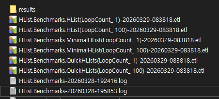
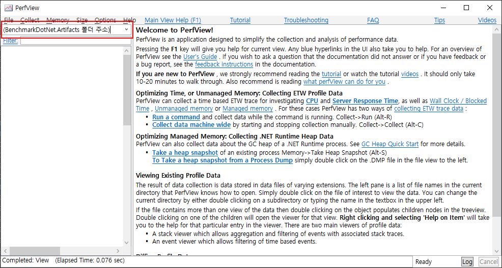
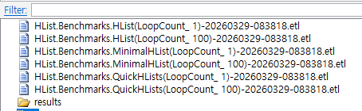
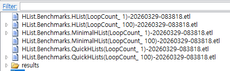
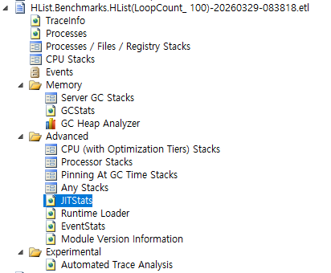
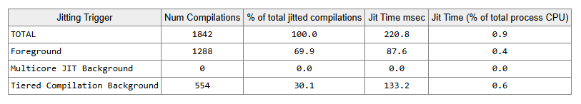
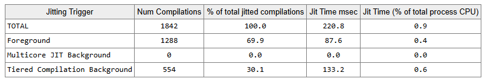

# BenchmarkDotNet 으로 성능 저하 원인 파악하기

## 들어가기

- 이전 문서: [BenchmarkDotNet 으로 F# 성능 테스트하기](https://nemonuri.github.io/blog/benchmarkdotnet-fsharp-test.html)

1. 성능 측정 결과, 내 라이브러리가 기존 라이브러리보다 오히려 뒤떨어진다!

| Method       | Mean     | Error   | StdDev  | Ratio | Exceptions | Gen0   | Allocated | Alloc Ratio |
|------------- |---------:|--------:|--------:|------:|-----------:|-------:|----------:|------------:|
| 기존         | 344.9 ns | 2.36 ns | 2.09 ns |  1.00 |          - | 0.0958 |    1504 B |        1.00 |
| 내 것        | 451.9 ns | 3.38 ns | 3.16 ns |  **1.31** |          - | 0.0448 |     704 B |        0.47 |

2. 코드 하나를 고쳤더니, 다행히 성능이 비슷해졌다.

| Method       | Mean        | Error     | StdDev    | Ratio | Exceptions | Gen0   | Allocated | Alloc Ratio |
|------------- |------------:|----------:|----------:|------:|-----------:|-------:|----------:|------------:|
| 기존         |    356.0 ns |   2.95 ns |   2.76 ns |  1.00 |          - | 0.0958 |    1504 B |        1.00 |
| 내 것        |    351.5 ns |   2.57 ns |   2.40 ns |  0.99 |          - | 0.0448 |     704 B |        0.47 |

3. 다른 조건에서 성능을 측정했더니, 내 라이브러리가 또 뒤떨어졌다...

| Method       | LoopCount | Mean        | Error     | StdDev    | Ratio | Exceptions | Gen0   | Allocated | Alloc Ratio |
|------------- |---------- |------------:|----------:|----------:|------:|-----------:|-------:|----------:|------------:|
| 기존         | 1         |    356.0 ns |   2.95 ns |   2.76 ns |  1.00 |          - | 0.0958 |    1504 B |        1.00 |
| 내 것        | 1         |    351.5 ns |   2.57 ns |   2.40 ns |  0.99 |          - | 0.0448 |     704 B |        0.47 |
|             |           |             |           |           |       |            |        |           |             |
| 기존        | 100       | 22,288.1 ns | 219.01 ns | 204.86 ns |  1.00 |          - | 3.3264 |   52192 B |       1.000 |
| 내 것       | 100       | 26,754.9 ns |  95.73 ns |  89.54 ns |  **1.20** |          - | 0.0305 |     704 B |       0.013 |

4. 내 것의 Alloc Ratio 가 1% 밖에 안 되는데, 실행 속도는 오히려 20%나 더 느리다고? 성능이 어떻게 이럴 수 있지?
    - 이 **어떻게** 를 어떻게 알 수 있을까?

## [EtwProfiler](https://benchmarkdotnet.org/articles/features/etwprofiler.html)

- '성능이 어떻게 이럴 수 있지?'의 '어떻게'를 알아내는 방법.
- **Event Tracing for Windows (ETW)** 를 이용해 성능을 측정한다.
  - GC, JIT 과 같은 .NET Runtime event 를 추적한다.
- 측정 결과는 [PerfView](https://github.com/Microsoft/perfview) 로 볼 수 있다.

> #### 사담
> - 추적은 영어로 Trace
> - 그래서 ETW 라이브러리 이름도 [Microsoft.Diagnostics.Tracing.**TraceEvent**](https://www.nuget.org/packages/Microsoft.Diagnostics.Tracing.TraceEvent)

### 단점

1. Windows 에서만 사용할 수 있다.
   - cross-platform 대용으로, [EventPipeProfiler](https://benchmarkdotnet.org/articles/features/event-pipe-profiler.html) 가 있다.
2. **관리자 권한** 으로 실행해야 한다.
   - ETW Kernel Session 을 열기 위해.
3. ETW 는 성능 측정용 앱 뿐만 아니라, 실행중인 모든 프로세스의 이벤트를 추적한다.
   - 그래서 결과에 불필요한 데이터가 많다.

## PerfView 로 결과 분석하기

### 준비하기

1. 성능 측정 후, **BenchmarkDotNet.Artifacts** 폴더 안에 etl 파일들이 생긴다.
   - 아래 그림과 같이.   

2. PerfView [Github Release](https://github.com/microsoft/perfview/releases) 에서 최신 exe 파일을 다운받아 실행하자.

3. PerfView 창이 뜨면, BenchmarkDotNet.Artifacts 폴더 주소를 주소창에 입력하자.
   - 빨간색으로 테두리 친 부분.   

4. 아래 그림과 같이, etl 파일들이 표시된다.
   - 

### 압축 풀기

1. etl 은 여러 데이터들이 압축된 파일. 파일 내부를 보려면, 압축을 풀어야 한다.
2. 보고자 하는 etl 파일을 더블 클릭하면, PerfView 가 해당 파일을 압축 해제한다.
   - 좀 시간이 걸린다.
3. 압축이 해제된 etl 파일 앞에는 '▷' 기호가 표시된다.
   - 사실 폴더 앞에도 표시된다.   
4. 압축 해제된 파일들은 임시 폴더에 저장된다.
   - 폴더 경로: `%USERNAME%/AppData/Local/Temp/PerfView`

## Jit Stats

1. **JITStats** 에서 Jit 관련 통계들을 확인할 수 있다.
  - 가상 경로: `(elt 파일)/Advanced/JITStats`
  - 

2. 그리고, 여기서 문제의 원인을 찾았다!

- 기존 라이브러리 Jit Stats

- 내 라이브러리 Jit Stats

## 결론

내 라이브러리가 더 느린 이유는 '[JIT startup delay](https://en.wikipedia.org/wiki/Just-in-time_compilation#Performance)' 때문 이...ㄴ 것 같다!
- 확실하진 않다.

## 향후 과제

1. 정말 Jit startup delay 때문인가? BenchmarkDotNet 으로, Jit startup delay 의 영향을 어떻게 분석하지?
2. Jit startup delay 의 영향이 최소화된 상황에서의 성능을 어떻게 분석하지? NativeAOT?
3. 실제 소비자에게 이 Jit startup delay 가 얼마나 큰 영향을 미칠까? 이를 어떻게 예측하지?
